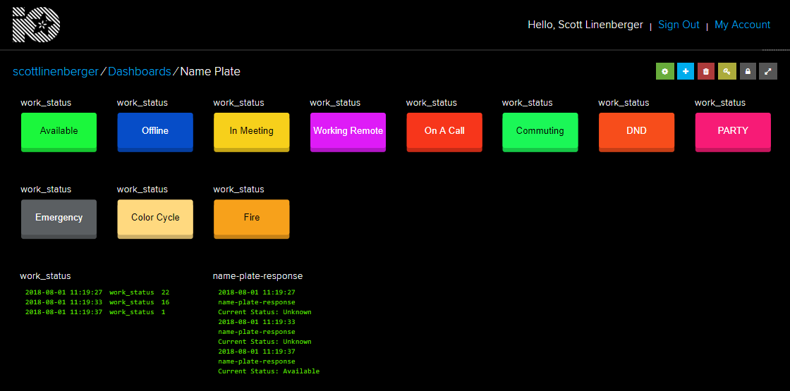
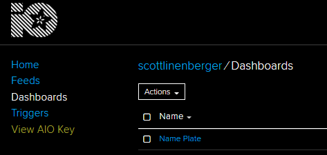

# IOT Status Indicator
Ever want to display the status of something with set of colored LEDs? For example: red lights mean "busy" or "do not disturb" or green lights means "ready to go". And do you want to be able to update that stutus from anywhere in the world using a WiFi or mobile connection? Well, today is your lucky day! Because the IOT status indicator is a simple library for creating a status WiFi connected status indicator using Adafruit's IO, WiFi capable devices and NeoPixels!   

## What You'll Need  
You'll need the [Arduino Code Editor][LINK_ARDUINO_IDE] or "IDE" (Integraged Development Environment). You'll also need an [Adafruit IO][LINK_IO] account and an Adafruit IO compatible WiFi board (I like the [Adafruit Feather Huzzah][LINK_PRODUCT_FEATHER_HUZZAH] or Huzzah Breakout with ESP8266). Lastly, you'll need some Adafruit NeoPixels (The basic usage example uses an [Adafruit NeoPixel Stick][LINK_PRODUCT_NEOPIXEL_STICK]). You don't have to use a NeoPixel Stick. You can tweak the example code and use whatever NeoPixels you like as long as they are compatible with the Adafruit NeoPixel library.  

This guide assumes you are using an [Adafruit Feather Huzzah][LINK_PRODUCT_FEATHER_HUZZAH], [NeoPixel Stick][LINK_PRODUCT_NEOPIXEL_STICK] and a [TXB0104 level shifter][LINK_PRODUCT_LEVEL_SHIFTER]. Again, you don't _have_ to use these components, but these components have been thorougly teseted with the IOT Status Indicator library.

### Adafruit IO  
You'll need an [Adafruit IO][LINK_IO] account. We'll use Adafruit IO to publish status updates to our indicator and subscribe to responses from the indicator, so we know our status change happened. Adafruit IO has dashboards that let you create really quick and simple blocks for interacting with your connected devices. I prefer using momentary buttons for changing my IOT Status Indicator, but you can use whatever block type you like. 

Adafruit has incredible resources to help get you setup. Check out the Adafruit [Learn][LINK_LEARN_IO] page if you are new to AdafruitIO and need some help getting started with feeds, dashboards and blocks. When you publish values to your feed to change status, you'll need to use the State Values listed below. 



## State Values  
The IOT Status Indicator uses numeric values to represent each state. Here are a list of the states you can use with an AdafruitIO feed for the IOT Status Indicator. 

|Numeric Value |LEDs                   |
|--------------|-----------------------|
|1             |Solid Green            |
|2             |Solid Yellow           |
|3             |Solid Blue             |
|4             |Solid Purple           |
|5             |Solid Red              |
|6             |Pulsing Green          |
|7             |Pulsing Red            |
|96            |Animation Fire         |
|97            |Animation Police       |
|98            |Animation Cycle Colors |
|99            |Animation Party        |

## Components  
Here is a complete list of the components used for the sample IOT Status Indicator example.

* [Adafruit Feather Huzzah][LINK_PRODUCT_FEATHER_HUZZAH] - [Learn About the Feather Huzzah][LINK_LEARN_FEATHER_HUZZAH]
* [Adafruit NeoPixel Stick][LINK_PRODUCT_NEOPIXEL_STICK] - [Learn About NeoPixels][LINK_LEARN_NEOPIXELS]
* [Adafruit Level Shifter - TXB0104][LINK_PRODUCT_LEVEL_SHIFTER]
* Breadboard - [Learn About Breadboards][LINK_LEARN_BREADBOARD]

## Feather Huzzah  
I am using Adafruit's Feather Huzzah with ESP8266, but you can also use Adafruit's Huzzah breakout with ESP8266 for this project as well. At the time of writing this document, the Adafruit Huzzah32 ESP32 Feather is still in development and has known issues with NeoPixels. For stability, I would recommend sticking to one of the ESP8266 boards at this time.  

The Feather Huzzah is simple to use with the Arduino IDE. Checkout the [Learn][LINK_LEARN_FEATHER_HUZZAH] page for the Feather Huzzah for all of the information you need to get started. 


## WIRING THE IOT STATUS INDICATOR
Here are the connections for wiring up the IOT Status Indicator using an Adafruit Feather Huzzah, NeoPixel Stick and TXB0104 level shifter on a bread board. The colors of wires don't actually change how the wire works. The colors are just a convention for representing what the wire is doing. For example, red, yellow and orange wires typically represent power connections. Blue, black and brown wires usually represent ground wires. But, you can use any color wire to make any connection. 

**[Level Shifter][LINK_PRODUCT_LEVEL_SHIFTER] TXB0104**

|Level Shifter Pin |Huzzah Pin |Wire Color    |
|------------------|-----------|--------------|
|LV                |3V         |Red or Yellow |
|HV                |USB        |Red or Yellow |
|GND               |GND        |Black or Blue |
|A1                |4          |White or Gray |

**[Neopixel Stick][LINK_PRODUCT_NEOPIXEL_STICK]**

|NeoPixel Pin      |Level Shifter Pin |Wire Color    |
|------------------|------------------|--------------|
|GND               |GND               |Black or Blue |
|DIN               |B1                |White or Gray |
|VDC               |HV                |Red or Yellow |

Here is a diagram for wiring the Adafruit Feather Huzzah. The bends in the wires are not important, only where each wire in the diagram starts and ends.


## Additional Libraries  
The IOT Status Indicator library relies on other Arduino Libraries. You'll need to download these additional libraries to compile and upload the IOT Status Indicator code. If you are running into an issue getting the IOT Status Indicator basic usage example to compile, you probably need to download the additional libraries listed below.

To download the additional libraries from the Arduino IDE, go to `Sketch->Include Library->Manage Libraries...` Then, search for the library by the name listed below and install. 

Alternatively, you can also go the Github links provided below, click on the "Clone or Download" button and download the libraries as zip files and then add them to your Arduino IDE by adding by clicking `Sketch -> Include Library -> Add .ZIP Library` 

* [Adafruit NeoPixel][LIBRARY_ADAFRUIT_NEOPIXEL] by Adafruit 
* [Adafruit IO][LIBRARY_ADAFRUIT_IO] by Adafruit 
* [Adafruit MQTT][LIBRARY_ADAFRUIT_MQTT] by Adafruit
* [Arduino HTTP Client (Experimental)][LIBRARY_ARDUINO_HTTP_CLIENT] by Arduino

## Using the IOT Status Indicator Library  
Download the IOT Status Indicator repository as a ZIP file by clicking on `Clone or Download -> Download ZIP`. Then import it into your Arduino IDE by clicking  
`Sketch -> Include Library -> Add .ZIP Library`. 

**Important:** make sure you have downloaded the additional libraries mentioned above! Without them, the IOT Status Indicator library will not compile.

Once you've added the library, you can open the usage example by using  
`File -> Examples -> iot_status_indicator-<version> -> basicUsage`  

In the example, set the values for the following variables  
```
#define IO_USERNAME ""
#define IO_KEY ""
#define WIFI_SSID ""
#define WIFI_PASS ""
```
`IO_USERNAME` and `IO_KEY` need to come from your AdafruitIO account and `WIFI_SSID` and `WIFI_PASS` are your WiFi credentials. To find your Adafruit IO click on the yellow text that says "View AIO Key" on the Adafruit IO main page after you've logged in.




[LINK_ARDUINO_IDE]: https://www.arduino.cc/en/Main/Software
[LINK_IO]: https://io.adafruit.com
[LINK_LEARN_IO]: https://learn.adafruit.com/adafruit-io/overview
[LINK_LEARN_NEOPIXELS]: https://learn.adafruit.com/adafruit-neopixel-uberguide/the-magic-of-neopixels?gclid=CjwKCAjwkYDbBRB6EiwAR0T_-mV0nic2zRmePrLDyuMCpvNuCJgbRTAAsS1rv5KyqeieUQSczDapPxoCP04QAvD_BwE
[LINK_LEARN_BREADBOARD]: https://learn.adafruit.com/breadboards-for-beginners?view=all
[LINK_PRODUCT_FEATHER_HUZZAH]: https://www.adafruit.com/product/2821
[LINK_PRODUCT_LEVEL_SHIFTER]: https://www.adafruit.com/product/1875
[LINK_PRODUCT_NEOPIXEL_STICK]: https://www.adafruit.com/product/1426
[LINK_LEARN_FEATHER_HUZZAH]: https://learn.adafruit.com/adafruit-feather-huzzah-esp8266?view=all
[LIBRARY_ADAFRUIT_NEOPIXEL]: https://github.com/adafruit/Adafruit_NeoPixel
[LIBRARY_ADAFRUIT_IO]: https://github.com/adafruit/Adafruit_IO_Arduino
[LIBRARY_ADAFRUIT_MQTT]: https://github.com/adafruit/Adafruit_MQTT_Library
[LIBRARY_ARDUINO_HTTP_CLIENT]: https://github.com/arduino-libraries/ArduinoHttpClient
